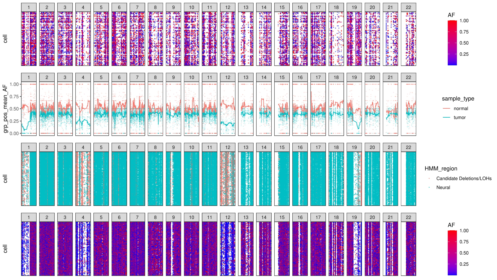
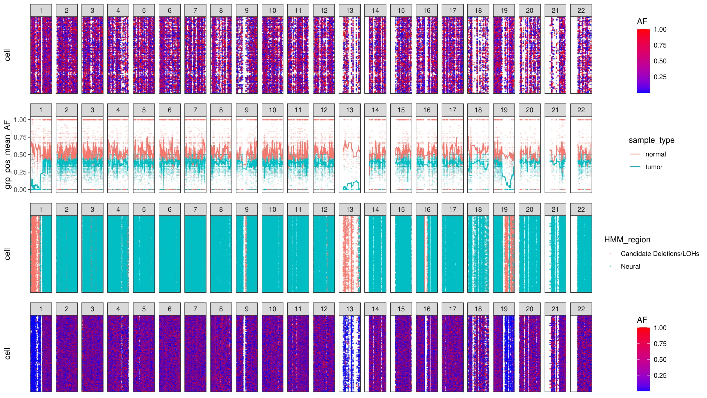
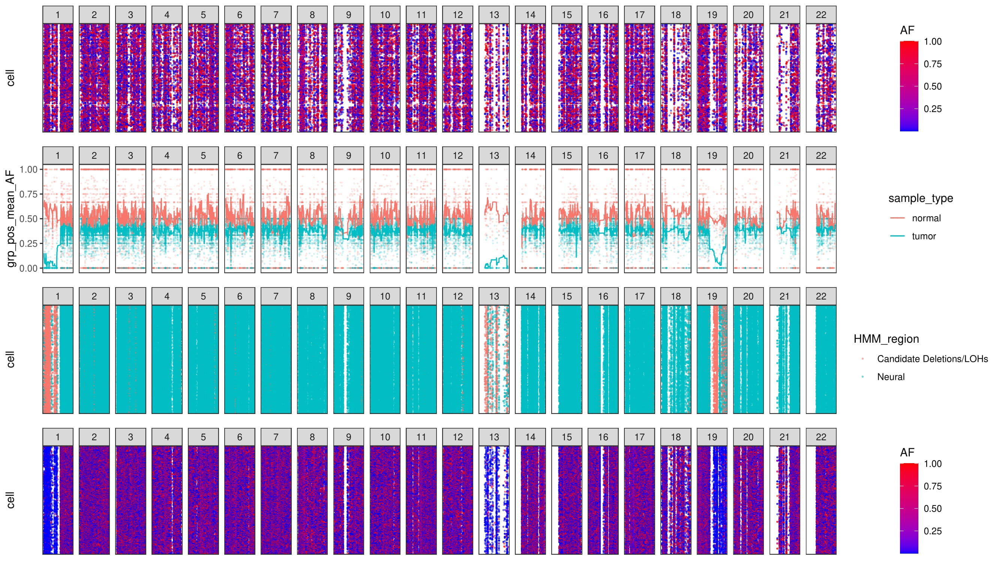
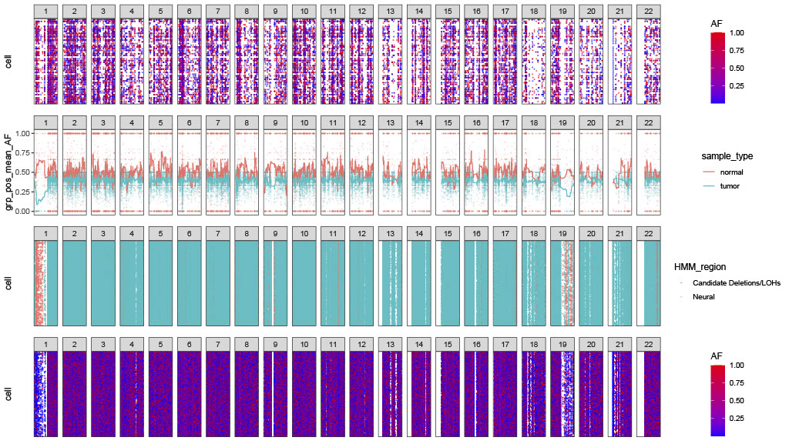
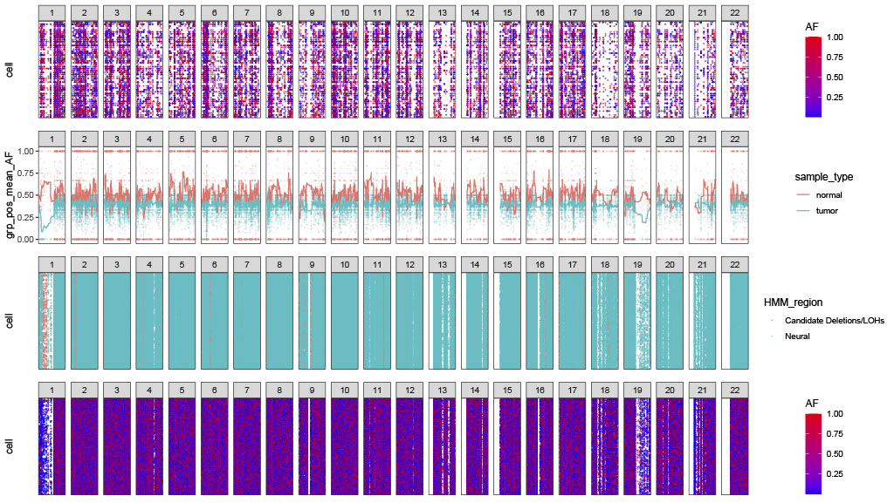
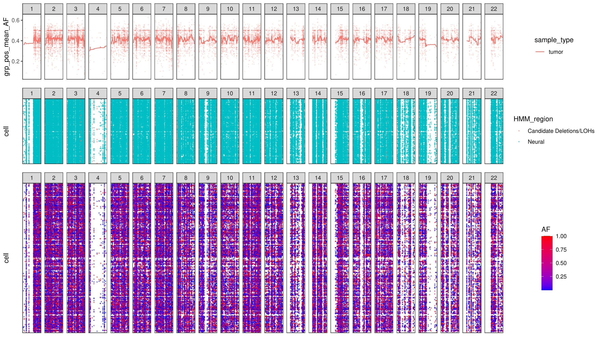
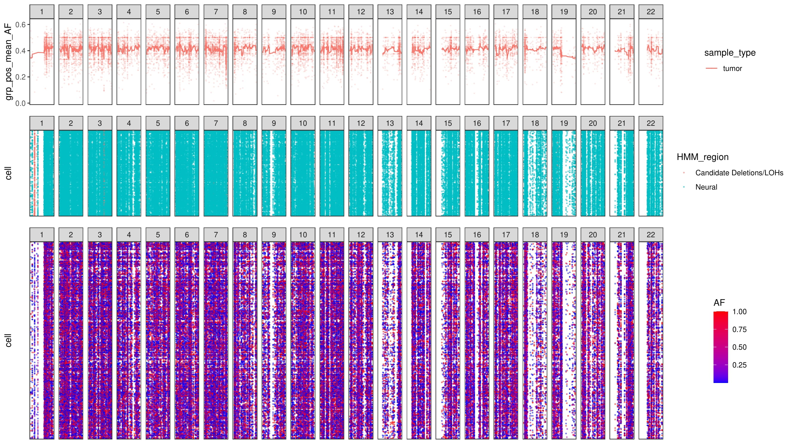
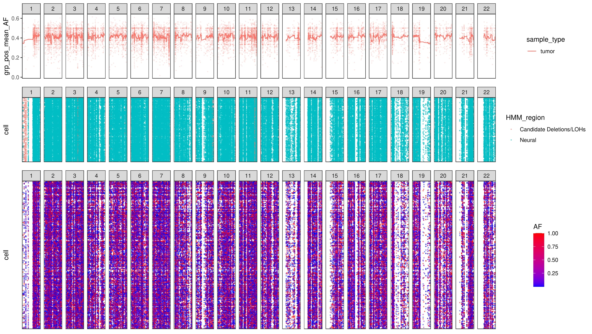
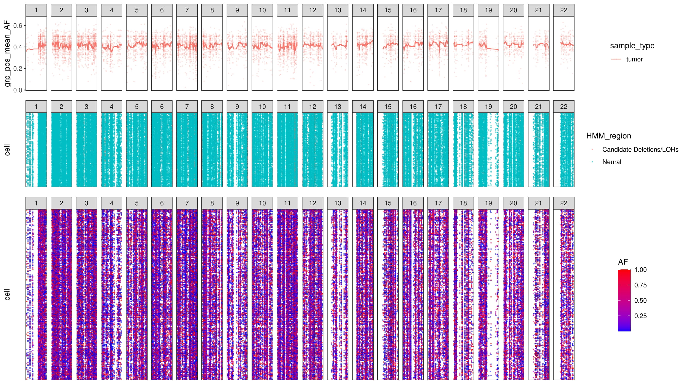

# HB-HMM
Extract the candidates of SNPs caused by deletion/LOH events using HMM model

## Update (2021/10/16):
### Main codes:
```
source("script/infercnv_allele.R")
file_name <- c("MGH36","MGH53", "MGH54")

res = list()
for(i in file_name){
  
  if(i == "MGH36"){
    ref_group_names = "Microglia/Macrophage" 
  }
  if(i %in% c("MGH53", "MGH54")){
    ref_group_names = c("Microglia/Macrophage","Oligodendrocytes (non-malignant)") 
  }
  
  test <- CreateInfercnvAlleleObject(allele_counts_matrix = paste0("processed_data/",i,".alt.dense.matrix"),
                                     coverage_counts_matrix = paste0("processed_data/",i,".tot.dense.matrix"),
                                     ref_annotation_file = "gencode_v19_gene_pos.txt",
                                     sample_annotation_file = paste0("processed_data/",i,".cell_types"),
                                     ref_group_names = ref_group_names,
                                     rowname_by = "::")
  test <- setAlleleMatrix(test, het.deviance.threshold = 0.1)
  test <- calAlleleBoundaries(test, distance_method = "Filter_threshold")
  plot_allele(test, name_to_plot = paste0(i,"_HMM_oct_seventeen_Filter_threshold.pdf"))
  test <- calAlleleBoundaries(test, distance_method = "Remove_NA")
  plot_allele(test, name_to_plot = paste0(i,"_HMM_oct_seventeen_Remove_NA.pdf"))
  test <- calAlleleBoundaries(test, distance_method = "HB")
  plot_allele(test, name_to_plot = paste0(i,"_HMM_oct_seventeen_HB.pdf"))
  
  res[[i]] <- test
}

file_name_2 <- c("MGH97","MGH60", "MGH93")
res_2 = list()
for(i in file_name_2){
  
  test <- CreateInfercnvAlleleObject(allele_counts_matrix = paste0("processed_data/",i,".alt.dense.matrix"),
                                     coverage_counts_matrix = paste0("processed_data/",i,".tot.dense.matrix"),
                                     ref_annotation_file = "gencode_v19_gene_pos.txt",
                                     sample_annotation_file = paste0("processed_data/",i,".cell_types"),
                                     ref_group_names = NULL,
                                     rowname_by = "::")
  test <- setAlleleMatrix(test, het.deviance.threshold = 0.1)
  test <- calAlleleBoundaries(test, distance_method = "Filter_threshold")
  plot_allele(test, name_to_plot = paste0(i,"_HMM_oct_seventeen_Filter_threshold.pdf"))
  test <- calAlleleBoundaries(test, distance_method = "Remove_NA")
  plot_allele(test, name_to_plot = paste0(i,"_HMM_oct_seventeen_Remove_NA.pdf"))
  test <- calAlleleBoundaries(test, distance_method = "HB")
  plot_allele(test, name_to_plot = paste0(i,"_HMM_oct_seventeen_HB.pdf"))
  
  res_2[[i]] <- test
}
```
### MGH36 sample using Filter_threshold method:


### MGH36 sample using Remove_NA method:


### MGH36 sample using HB method:


### MGH53 sample using Filter_threshold method:


### MGH53 sample using Remove_NA method:


### MGH53 sample using HB method:



### MGH54 sample using Filter_threshold method:


### MGH54 sample using Remove_NA method:


### MGH54 sample using HB method:



### MGH60 sample using Filter_threshold method:


### MGH60 sample using Remove_NA method:


### MGH60 sample using HB method:


### MGH93 sample using Filter_threshold method:


### MGH93 sample using Remove_NA method:


### MGH93 sample using HB method:


### MGH97 sample using Filter_threshold method:


### MGH97 sample using Remove_NA method:


### MGH97 sample using HB method:


### Running logs for file_name_2 ("MGH36","MGH53", "MGH54")
```
INFO [2021-10-18 09:25:42] Parsing matrix: processed_data/MGH36.alt.dense.matrix ...
INFO [2021-10-18 09:28:15] Parsing matrix: processed_data/MGH36.tot.dense.matrix ...
INFO [2021-10-18 09:30:22] Creating in-silico bulk ...
INFO [2021-10-18 09:30:30] Parsing gene annotation file: gencode_v19_gene_pos.txt ...
INFO [2021-10-18 09:30:30] Parsing cell annotation file: processed_data/MGH36.cell_types ...
INFO [2021-10-18 09:31:01] Validating infercnv_allele obejct ...
INFO [2021-10-18 09:31:12] 506855 heterozygous SNPs identified ...
INFO [2021-10-18 09:31:22] Setting composite lesser allele count ...
INFO [2021-10-18 09:31:32] Done setting initial allele matrices!
INFO [2021-10-18 09:31:32] Starting cluster cells from population ...
INFO [2021-10-18 09:31:35] Using Filter_threshold to process matrix ...
INFO [2021-10-18 09:32:43] Starting calculate distance ...
INFO [2021-10-18 09:37:21] Starting calculate Hierarchical Clustering ...
INFO [2021-10-18 09:37:21] Starting iterative HMM ...
INFO [2021-10-18 09:43:43] Done extracting HMM regions ...
INFO [2021-10-18 09:44:13] Building snp plot ...
INFO [2021-10-18 09:44:29] Number het snps used: 16816 ...
INFO [2021-10-18 09:44:29] Setting alt allele fraction to the tumor cell-population minor allele ...
INFO [2021-10-18 09:44:35] Melting matrix ...
INFO [2021-10-18 09:44:58] Generating outputs ...
INFO [2021-10-18 09:44:58] Making normal plot ...
INFO [2021-10-18 09:44:58] Making malignant plot ...
INFO [2021-10-18 09:44:58] Making allele freq plot ...
INFO [2021-10-18 09:45:12] Smoothing sample means for trend lines ...
INFO [2021-10-18 09:45:19] Making HMM prediction plot ...
INFO [2021-10-18 09:45:53] Done!
INFO [2021-10-18 09:45:53] Starting cluster cells from population ...
INFO [2021-10-18 09:45:56] Using Remove_NA to process matrix ...
INFO [2021-10-18 09:46:46] Starting calculate distance ...
INFO [2021-10-18 09:50:59] Starting calculate Hierarchical Clustering ...
INFO [2021-10-18 09:50:59] Starting iterative HMM ...
INFO [2021-10-18 09:57:22] Done extracting HMM regions ...
INFO [2021-10-18 09:57:47] Building snp plot ...
INFO [2021-10-18 09:58:03] Number het snps used: 16816 ...
INFO [2021-10-18 09:58:03] Setting alt allele fraction to the tumor cell-population minor allele ...
INFO [2021-10-18 09:58:09] Melting matrix ...
INFO [2021-10-18 09:58:30] Generating outputs ...
INFO [2021-10-18 09:58:30] Making normal plot ...
INFO [2021-10-18 09:58:31] Making malignant plot ...
INFO [2021-10-18 09:58:31] Making allele freq plot ...
INFO [2021-10-18 09:58:45] Smoothing sample means for trend lines ...
INFO [2021-10-18 09:58:52] Making HMM prediction plot ...
INFO [2021-10-18 09:59:22] Done!
INFO [2021-10-18 09:59:22] Starting cluster cells from population ...
INFO [2021-10-18 09:59:25] Using HB to process matrix ...
INFO [2021-10-18 10:00:10] Starting calculate distance ...
INFO [2021-10-18 10:41:21] Starting calculate Hierarchical Clustering ...
INFO [2021-10-18 10:41:21] Starting iterative HMM ...
INFO [2021-10-18 10:47:44] Done extracting HMM regions ...
INFO [2021-10-18 10:48:08] Building snp plot ...
INFO [2021-10-18 10:48:26] Number het snps used: 16816 ...
INFO [2021-10-18 10:48:26] Setting alt allele fraction to the tumor cell-population minor allele ...
INFO [2021-10-18 10:48:32] Melting matrix ...
INFO [2021-10-18 10:48:53] Generating outputs ...
INFO [2021-10-18 10:48:53] Making normal plot ...
INFO [2021-10-18 10:48:53] Making malignant plot ...
INFO [2021-10-18 10:48:53] Making allele freq plot ...
INFO [2021-10-18 10:49:07] Smoothing sample means for trend lines ...
INFO [2021-10-18 10:49:14] Making HMM prediction plot ...
INFO [2021-10-18 10:49:44] Done!
INFO [2021-10-18 10:49:44] Parsing matrix: processed_data/MGH53.alt.dense.matrix ...
INFO [2021-10-18 10:50:22] Parsing matrix: processed_data/MGH53.tot.dense.matrix ...
INFO [2021-10-18 10:51:04] Creating in-silico bulk ...
INFO [2021-10-18 10:51:07] Parsing gene annotation file: gencode_v19_gene_pos.txt ...
INFO [2021-10-18 10:51:07] Parsing cell annotation file: processed_data/MGH53.cell_types ...
INFO [2021-10-18 10:51:15] Validating infercnv_allele obejct ...
INFO [2021-10-18 10:51:19] 122587 heterozygous SNPs identified ...
INFO [2021-10-18 10:51:21] Setting composite lesser allele count ...
INFO [2021-10-18 10:51:23] Done setting initial allele matrices!
INFO [2021-10-18 10:51:23] Starting cluster cells from population ...
INFO [2021-10-18 10:51:23] Using Filter_threshold to process matrix ...
INFO [2021-10-18 10:51:43] Starting calculate distance ...
INFO [2021-10-18 10:53:25] Starting calculate Hierarchical Clustering ...
INFO [2021-10-18 10:53:25] Starting iterative HMM ...
INFO [2021-10-18 10:54:37] Done extracting HMM regions ...
INFO [2021-10-18 10:54:45] Building snp plot ...
INFO [2021-10-18 10:54:51] Number het snps used: 31684 ...
INFO [2021-10-18 10:54:51] Setting alt allele fraction to the tumor cell-population minor allele ...
INFO [2021-10-18 10:55:07] Melting matrix ...
INFO [2021-10-18 10:56:21] Generating outputs ...
INFO [2021-10-18 10:56:21] Making normal plot ...
INFO [2021-10-18 10:56:21] Making malignant plot ...
INFO [2021-10-18 10:56:21] Making allele freq plot ...
INFO [2021-10-18 10:56:45] Smoothing sample means for trend lines ...
INFO [2021-10-18 10:56:58] Making HMM prediction plot ...
INFO [2021-10-18 10:57:45] Done!
INFO [2021-10-18 10:57:45] Starting cluster cells from population ...
INFO [2021-10-18 10:57:47] Using Remove_NA to process matrix ...
INFO [2021-10-18 10:58:10] Starting calculate distance ...
INFO [2021-10-18 10:59:52] Starting calculate Hierarchical Clustering ...
INFO [2021-10-18 10:59:53] Starting iterative HMM ...
INFO [2021-10-18 11:01:01] Done extracting HMM regions ...
INFO [2021-10-18 11:01:09] Building snp plot ...
INFO [2021-10-18 11:01:15] Number het snps used: 31684 ...
INFO [2021-10-18 11:01:15] Setting alt allele fraction to the tumor cell-population minor allele ...
INFO [2021-10-18 11:01:31] Melting matrix ...
INFO [2021-10-18 11:02:33] Generating outputs ...
INFO [2021-10-18 11:02:33] Making normal plot ...
INFO [2021-10-18 11:02:33] Making malignant plot ...
INFO [2021-10-18 11:02:33] Making allele freq plot ...
INFO [2021-10-18 11:02:57] Smoothing sample means for trend lines ...
INFO [2021-10-18 11:03:09] Making HMM prediction plot ...
INFO [2021-10-18 11:03:55] Done!
INFO [2021-10-18 11:03:55] Starting cluster cells from population ...
INFO [2021-10-18 11:03:57] Using HB to process matrix ...
INFO [2021-10-18 11:04:10] Starting calculate distance ...
INFO [2021-10-18 11:18:35] Starting calculate Hierarchical Clustering ...
INFO [2021-10-18 11:18:35] Starting iterative HMM ...
INFO [2021-10-18 11:19:49] Done extracting HMM regions ...
INFO [2021-10-18 11:19:58] Building snp plot ...
INFO [2021-10-18 11:20:04] Number het snps used: 31684 ...
INFO [2021-10-18 11:20:04] Setting alt allele fraction to the tumor cell-population minor allele ...
INFO [2021-10-18 11:20:24] Melting matrix ...
INFO [2021-10-18 11:21:22] Generating outputs ...
INFO [2021-10-18 11:21:22] Making normal plot ...
INFO [2021-10-18 11:21:23] Making malignant plot ...
INFO [2021-10-18 11:21:23] Making allele freq plot ...
INFO [2021-10-18 11:21:44] Smoothing sample means for trend lines ...
INFO [2021-10-18 11:21:56] Making HMM prediction plot ...
INFO [2021-10-18 11:22:41] Done!
INFO [2021-10-18 11:22:41] Parsing matrix: processed_data/MGH54.alt.dense.matrix ...
INFO [2021-10-18 11:23:39] Parsing matrix: processed_data/MGH54.tot.dense.matrix ...
INFO [2021-10-18 11:24:49] Creating in-silico bulk ...
INFO [2021-10-18 11:24:53] Parsing gene annotation file: gencode_v19_gene_pos.txt ...
INFO [2021-10-18 11:24:53] Parsing cell annotation file: processed_data/MGH54.cell_types ...
INFO [2021-10-18 11:25:06] Validating infercnv_allele obejct ...
INFO [2021-10-18 11:25:12] 129675 heterozygous SNPs identified ...
INFO [2021-10-18 11:25:18] Setting composite lesser allele count ...
INFO [2021-10-18 11:25:22] Done setting initial allele matrices!
INFO [2021-10-18 11:25:22] Starting cluster cells from population ...
INFO [2021-10-18 11:25:23] Using Filter_threshold to process matrix ...
INFO [2021-10-18 11:25:58] Starting calculate distance ...
INFO [2021-10-18 11:29:34] Starting calculate Hierarchical Clustering ...
INFO [2021-10-18 11:29:34] Starting iterative HMM ...
INFO [2021-10-18 11:30:56] Done extracting HMM regions ...
INFO [2021-10-18 11:31:09] Building snp plot ...
INFO [2021-10-18 11:31:18] Number het snps used: 36047 ...
INFO [2021-10-18 11:31:18] Setting alt allele fraction to the tumor cell-population minor allele ...
INFO [2021-10-18 11:31:45] Melting matrix ...
INFO [2021-10-18 11:33:44] Generating outputs ...
INFO [2021-10-18 11:33:44] Making normal plot ...
INFO [2021-10-18 11:33:44] Making malignant plot ...
INFO [2021-10-18 11:33:44] Making allele freq plot ...
INFO [2021-10-18 11:34:12] Smoothing sample means for trend lines ...
INFO [2021-10-18 11:34:25] Making HMM prediction plot ...
INFO [2021-10-18 11:35:25] Done!
INFO [2021-10-18 11:35:25] Starting cluster cells from population ...
INFO [2021-10-18 11:35:27] Using Remove_NA to process matrix ...
INFO [2021-10-18 11:36:04] Starting calculate distance ...
INFO [2021-10-18 11:39:38] Starting calculate Hierarchical Clustering ...
INFO [2021-10-18 11:39:38] Starting iterative HMM ...
INFO [2021-10-18 11:41:03] Done extracting HMM regions ...
INFO [2021-10-18 11:41:16] Building snp plot ...
INFO [2021-10-18 11:41:26] Number het snps used: 36047 ...
INFO [2021-10-18 11:41:26] Setting alt allele fraction to the tumor cell-population minor allele ...
INFO [2021-10-18 11:41:53] Melting matrix ...
INFO [2021-10-18 11:43:37] Generating outputs ...
INFO [2021-10-18 11:43:37] Making normal plot ...
INFO [2021-10-18 11:43:37] Making malignant plot ...
INFO [2021-10-18 11:43:44] Making allele freq plot ...
INFO [2021-10-18 11:44:09] Smoothing sample means for trend lines ...
INFO [2021-10-18 11:44:21] Making HMM prediction plot ...
INFO [2021-10-18 11:45:19] Done!
INFO [2021-10-18 11:45:19] Starting cluster cells from population ...
INFO [2021-10-18 11:45:21] Using HB to process matrix ...
INFO [2021-10-18 11:45:48] Starting calculate distance ...
INFO [2021-10-18 12:14:40] Starting calculate Hierarchical Clustering ...
INFO [2021-10-18 12:14:41] Starting iterative HMM ...
INFO [2021-10-18 12:16:07] Done extracting HMM regions ...
INFO [2021-10-18 12:16:20] Building snp plot ...
INFO [2021-10-18 12:16:30] Number het snps used: 36047 ...
INFO [2021-10-18 12:16:30] Setting alt allele fraction to the tumor cell-population minor allele ...
INFO [2021-10-18 12:17:00] Melting matrix ...
INFO [2021-10-18 12:18:46] Generating outputs ...
INFO [2021-10-18 12:18:46] Making normal plot ...
INFO [2021-10-18 12:18:46] Making malignant plot ...
INFO [2021-10-18 12:18:46] Making allele freq plot ...
INFO [2021-10-18 12:19:14] Smoothing sample means for trend lines ...
INFO [2021-10-18 12:19:25] Making HMM prediction plot ...
INFO [2021-10-18 12:20:24] Done!

```

### Running logs for file_name_2 ("MGH97","MGH60", "MGH93")
```
INFO [2021-10-17 22:31:52] Parsing matrix: processed_data/MGH97.alt.dense.matrix ...
INFO [2021-10-17 22:32:08] Parsing matrix: processed_data/MGH97.tot.dense.matrix ...
INFO [2021-10-17 22:32:22] Creating in-silico bulk ...
INFO [2021-10-17 22:32:22] Parsing gene annotation file: gencode_v19_gene_pos.txt ...
INFO [2021-10-17 22:32:23] Parsing cell annotation file: processed_data/MGH97.cell_types ...
INFO [2021-10-17 22:32:26] Validating infercnv_allele obejct ...
INFO [2021-10-17 22:32:27] 38803 heterozygous SNPs identified ...
INFO [2021-10-17 22:32:28] Setting composite lesser allele count ...
INFO [2021-10-17 22:32:30] Done setting initial allele matrices!
INFO [2021-10-17 22:32:30] Starting cluster cells from population ...
INFO [2021-10-17 22:32:30] Using Filter_threshold to process matrix ...
INFO [2021-10-17 22:32:35] Starting calculate distance ...
INFO [2021-10-17 22:32:47] Starting calculate Hierarchical Clustering ...
INFO [2021-10-17 22:32:47] Starting iterative HMM ...
INFO [2021-10-17 22:33:05] Done extracting HMM regions ...
INFO [2021-10-17 22:33:07] Building snp plot ...
INFO [2021-10-17 22:33:09] Number het snps used: 8808 ...
INFO [2021-10-17 22:33:09] Setting alt allele fraction to the tumor cell-population minor allele ...
INFO [2021-10-17 22:33:12] Melting matrix ...
INFO [2021-10-17 22:33:25] Generating outputs ...
INFO [2021-10-17 22:33:25] Making malignant plot ...
INFO [2021-10-17 22:33:25] Making allele freq plot ...
INFO [2021-10-17 22:33:30] Smoothing sample means for trend lines ...
INFO [2021-10-17 22:33:32] Making HMM prediction plot ...
INFO [2021-10-17 22:33:55] Done!
INFO [2021-10-17 22:33:55] Starting cluster cells from population ...
INFO [2021-10-17 22:33:55] Using Remove_NA to process matrix ...
INFO [2021-10-17 22:33:59] Starting calculate distance ...
INFO [2021-10-17 22:34:11] Starting calculate Hierarchical Clustering ...
INFO [2021-10-17 22:34:11] Starting iterative HMM ...
INFO [2021-10-17 22:34:31] Done extracting HMM regions ...
INFO [2021-10-17 22:34:33] Building snp plot ...
INFO [2021-10-17 22:34:35] Number het snps used: 8808 ...
INFO [2021-10-17 22:34:35] Setting alt allele fraction to the tumor cell-population minor allele ...
INFO [2021-10-17 22:34:38] Melting matrix ...
INFO [2021-10-17 22:34:49] Generating outputs ...
INFO [2021-10-17 22:34:49] Making malignant plot ...
INFO [2021-10-17 22:34:50] Making allele freq plot ...
INFO [2021-10-17 22:34:55] Smoothing sample means for trend lines ...
INFO [2021-10-17 22:34:58] Making HMM prediction plot ...
INFO [2021-10-17 22:35:14] Done!
INFO [2021-10-17 22:35:14] Starting cluster cells from population ...
INFO [2021-10-17 22:35:14] Using HB to process matrix ...
INFO [2021-10-17 22:35:17] Starting calculate distance ...
INFO [2021-10-17 22:37:08] Starting calculate Hierarchical Clustering ...
INFO [2021-10-17 22:37:08] Starting iterative HMM ...
INFO [2021-10-17 22:37:26] Done extracting HMM regions ...
INFO [2021-10-17 22:37:28] Building snp plot ...
INFO [2021-10-17 22:37:31] Number het snps used: 8808 ...
INFO [2021-10-17 22:37:31] Setting alt allele fraction to the tumor cell-population minor allele ...
INFO [2021-10-17 22:37:34] Melting matrix ...
INFO [2021-10-17 22:37:46] Generating outputs ...
INFO [2021-10-17 22:37:46] Making malignant plot ...
INFO [2021-10-17 22:37:46] Making allele freq plot ...
INFO [2021-10-17 22:37:51] Smoothing sample means for trend lines ...
INFO [2021-10-17 22:37:54] Making HMM prediction plot ...
INFO [2021-10-17 22:38:10] Done!
INFO [2021-10-17 22:38:10] Parsing matrix: processed_data/MGH60.alt.dense.matrix ...
INFO [2021-10-17 22:38:21] Parsing matrix: processed_data/MGH60.tot.dense.matrix ...
INFO [2021-10-17 22:38:31] Creating in-silico bulk ...
INFO [2021-10-17 22:38:32] Parsing gene annotation file: gencode_v19_gene_pos.txt ...
INFO [2021-10-17 22:38:32] Parsing cell annotation file: processed_data/MGH60.cell_types ...
INFO [2021-10-17 22:38:35] Validating infercnv_allele obejct ...
INFO [2021-10-17 22:38:37] 55835 heterozygous SNPs identified ...
INFO [2021-10-17 22:38:38] Setting composite lesser allele count ...
INFO [2021-10-17 22:38:38] Done setting initial allele matrices!
INFO [2021-10-17 22:38:38] Starting cluster cells from population ...
INFO [2021-10-17 22:38:39] Using Filter_threshold to process matrix ...
INFO [2021-10-17 22:38:44] Starting calculate distance ...
INFO [2021-10-17 22:38:56] Starting calculate Hierarchical Clustering ...
INFO [2021-10-17 22:38:56] Starting iterative HMM ...
INFO [2021-10-17 22:39:22] Done extracting HMM regions ...
INFO [2021-10-17 22:39:24] Building snp plot ...
INFO [2021-10-17 22:39:26] Number het snps used: 12710 ...
INFO [2021-10-17 22:39:26] Setting alt allele fraction to the tumor cell-population minor allele ...
INFO [2021-10-17 22:39:29] Melting matrix ...
INFO [2021-10-17 22:39:43] Generating outputs ...
INFO [2021-10-17 22:39:43] Making malignant plot ...
INFO [2021-10-17 22:39:43] Making allele freq plot ...
INFO [2021-10-17 22:39:49] Smoothing sample means for trend lines ...
INFO [2021-10-17 22:39:52] Making HMM prediction plot ...
INFO [2021-10-17 22:40:10] Done!
INFO [2021-10-17 22:40:10] Starting cluster cells from population ...
INFO [2021-10-17 22:40:11] Using Remove_NA to process matrix ...
INFO [2021-10-17 22:40:15] Starting calculate distance ...
INFO [2021-10-17 22:40:26] Starting calculate Hierarchical Clustering ...
INFO [2021-10-17 22:40:26] Starting iterative HMM ...
INFO [2021-10-17 22:40:53] Done extracting HMM regions ...
INFO [2021-10-17 22:40:55] Building snp plot ...
INFO [2021-10-17 22:40:56] Number het snps used: 12710 ...
INFO [2021-10-17 22:40:56] Setting alt allele fraction to the tumor cell-population minor allele ...
INFO [2021-10-17 22:41:00] Melting matrix ...
INFO [2021-10-17 22:41:11] Generating outputs ...
INFO [2021-10-17 22:41:11] Making malignant plot ...
INFO [2021-10-17 22:41:11] Making allele freq plot ...
INFO [2021-10-17 22:41:18] Smoothing sample means for trend lines ...
INFO [2021-10-17 22:41:21] Making HMM prediction plot ...
INFO [2021-10-17 22:41:39] Done!
INFO [2021-10-17 22:41:39] Starting cluster cells from population ...
INFO [2021-10-17 22:41:40] Using HB to process matrix ...
INFO [2021-10-17 22:41:43] Starting calculate distance ...
INFO [2021-10-17 22:43:08] Starting calculate Hierarchical Clustering ...
INFO [2021-10-17 22:43:08] Starting iterative HMM ...
INFO [2021-10-17 22:43:34] Done extracting HMM regions ...
INFO [2021-10-17 22:43:38] Building snp plot ...
INFO [2021-10-17 22:43:39] Number het snps used: 12710 ...
INFO [2021-10-17 22:43:39] Setting alt allele fraction to the tumor cell-population minor allele ...
INFO [2021-10-17 22:43:43] Melting matrix ...
INFO [2021-10-17 22:43:57] Generating outputs ...
INFO [2021-10-17 22:43:57] Making malignant plot ...
INFO [2021-10-17 22:43:57] Making allele freq plot ...
INFO [2021-10-17 22:44:06] Smoothing sample means for trend lines ...
INFO [2021-10-17 22:44:10] Making HMM prediction plot ...
INFO [2021-10-17 22:44:29] Done!
INFO [2021-10-17 22:44:29] Parsing matrix: processed_data/MGH93.alt.dense.matrix ...
INFO [2021-10-17 22:44:39] Parsing matrix: processed_data/MGH93.tot.dense.matrix ...
INFO [2021-10-17 22:44:52] Creating in-silico bulk ...
INFO [2021-10-17 22:44:53] Parsing gene annotation file: gencode_v19_gene_pos.txt ...
INFO [2021-10-17 22:44:53] Parsing cell annotation file: processed_data/MGH93.cell_types ...
INFO [2021-10-17 22:44:56] Validating infercnv_allele obejct ...
INFO [2021-10-17 22:44:58] 58831 heterozygous SNPs identified ...
INFO [2021-10-17 22:44:58] Setting composite lesser allele count ...
INFO [2021-10-17 22:44:59] Done setting initial allele matrices!
INFO [2021-10-17 22:44:59] Starting cluster cells from population ...
INFO [2021-10-17 22:44:59] Using Filter_threshold to process matrix ...
INFO [2021-10-17 22:45:05] Starting calculate distance ...
INFO [2021-10-17 22:45:18] Starting calculate Hierarchical Clustering ...
INFO [2021-10-17 22:45:18] Starting iterative HMM ...
INFO [2021-10-17 22:45:45] Done extracting HMM regions ...
INFO [2021-10-17 22:45:47] Building snp plot ...
INFO [2021-10-17 22:45:49] Number het snps used: 13862 ...
INFO [2021-10-17 22:45:49] Setting alt allele fraction to the tumor cell-population minor allele ...
INFO [2021-10-17 22:45:53] Melting matrix ...
INFO [2021-10-17 22:46:07] Generating outputs ...
INFO [2021-10-17 22:46:07] Making malignant plot ...
INFO [2021-10-17 22:46:07] Making allele freq plot ...
INFO [2021-10-17 22:46:15] Smoothing sample means for trend lines ...
INFO [2021-10-17 22:46:19] Making HMM prediction plot ...
INFO [2021-10-17 22:46:39] Done!
INFO [2021-10-17 22:46:39] Starting cluster cells from population ...
INFO [2021-10-17 22:46:40] Using Remove_NA to process matrix ...
INFO [2021-10-17 22:46:43] Starting calculate distance ...
INFO [2021-10-17 22:46:56] Starting calculate Hierarchical Clustering ...
INFO [2021-10-17 22:46:56] Starting iterative HMM ...
INFO [2021-10-17 22:47:25] Done extracting HMM regions ...
INFO [2021-10-17 22:47:28] Building snp plot ...
INFO [2021-10-17 22:47:29] Number het snps used: 13862 ...
INFO [2021-10-17 22:47:29] Setting alt allele fraction to the tumor cell-population minor allele ...
INFO [2021-10-17 22:47:33] Melting matrix ...
INFO [2021-10-17 22:47:46] Generating outputs ...
INFO [2021-10-17 22:47:46] Making malignant plot ...
INFO [2021-10-17 22:47:47] Making allele freq plot ...
INFO [2021-10-17 22:47:56] Smoothing sample means for trend lines ...
INFO [2021-10-17 22:48:00] Making HMM prediction plot ...
INFO [2021-10-17 22:48:21] Done!
INFO [2021-10-17 22:48:21] Starting cluster cells from population ...
INFO [2021-10-17 22:48:21] Using HB to process matrix ...
INFO [2021-10-17 22:48:27] Starting calculate distance ...
INFO [2021-10-17 22:49:57] Starting calculate Hierarchical Clustering ...
INFO [2021-10-17 22:49:57] Starting iterative HMM ...
INFO [2021-10-17 22:50:25] Done extracting HMM regions ...
INFO [2021-10-17 22:50:27] Building snp plot ...
INFO [2021-10-17 22:50:29] Number het snps used: 13862 ...
INFO [2021-10-17 22:50:29] Setting alt allele fraction to the tumor cell-population minor allele ...
INFO [2021-10-17 22:50:33] Melting matrix ...
INFO [2021-10-17 22:50:46] Generating outputs ...
INFO [2021-10-17 22:50:46] Making malignant plot ...
INFO [2021-10-17 22:50:47] Making allele freq plot ...
INFO [2021-10-17 22:50:54] Smoothing sample means for trend lines ...
INFO [2021-10-17 22:50:57] Making HMM prediction plot ...
INFO [2021-10-17 22:51:17] Done!
```

